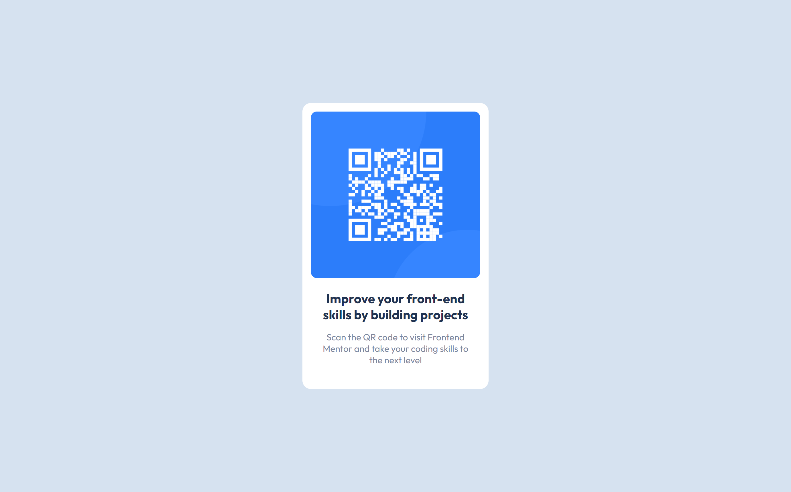

# QR code component

> This is a replica design from Frontend Mentor

> 📄 The idea was to recreate this design looking as close as possible to the original one. To accomplish this task, I used HTML and CSS (FlexBox). You can access the project and the original design down below.

## 🔗 Links:

> [Project link](https://caiomiyaji.github.io/challenge002/)

> [Design link](https://www.frontendmentor.io/challenges/qr-code-component-iux_sIO_H)

## 🤩 Contact:

c.hidekimiyaji@gmail.com
